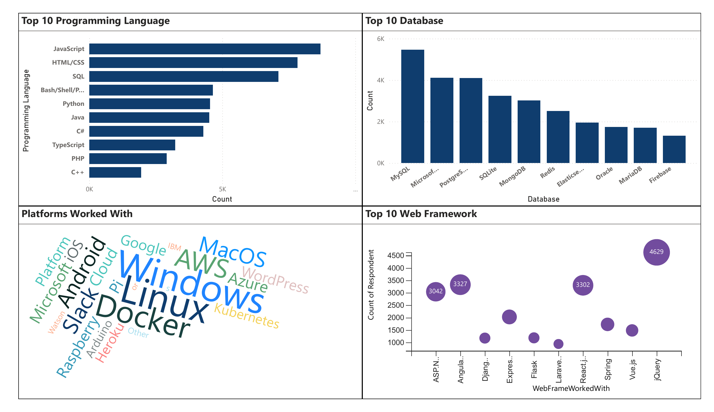
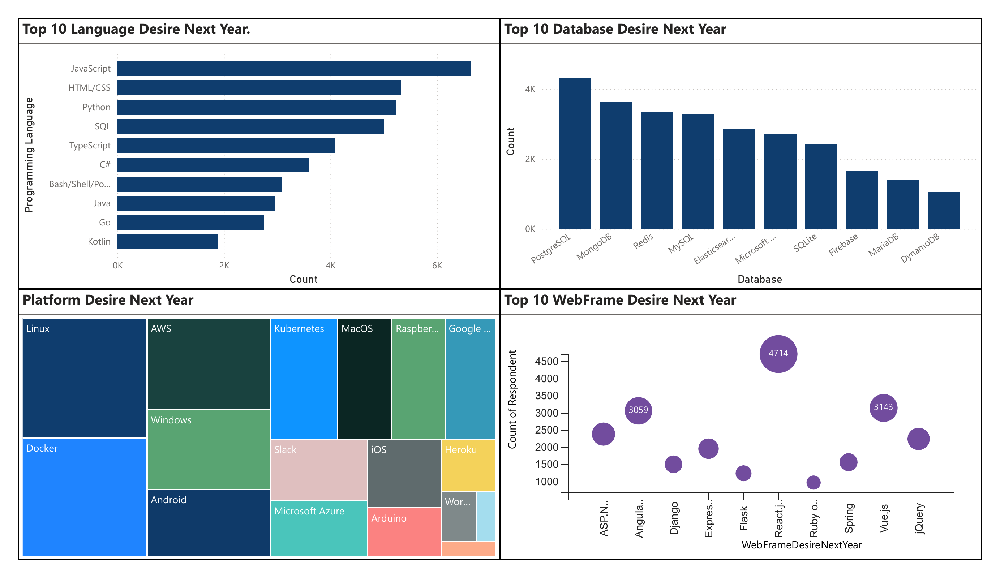
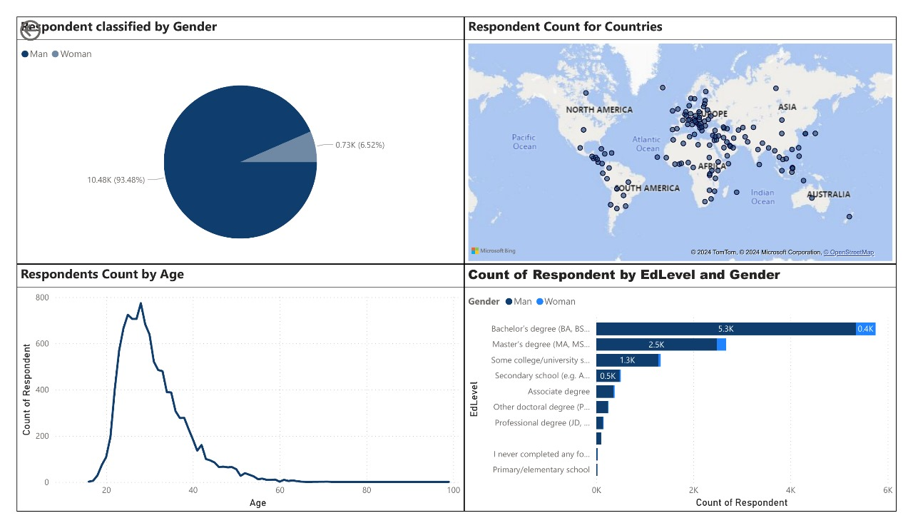

<h1 style="color:cyan;">Tech Trends Analysis: Current and Future Usage of Programming Tools</h1>

The <strong>Tech Trends Analysis</strong> project examines <strong>current</strong> and <strong>future trends</strong> in programming languages, databases, web frameworks, and platforms. Data is collected from surveys of developers, data professionals, and educators. As technology evolves rapidly, understanding these trends is critical for making informed decisions regarding <strong>development practices</strong> and <strong>tool selection</strong>.

<h2 style="color:cyan;">Current Usage of Technologies</h2>

This dashboard represents the <strong>Top 10 Programming Languages</strong>, <strong>Top 10 Databases</strong>, <strong>Top 10 Web Frameworks</strong>, and <strong>Top 10 Platforms</strong> (such as Windows, Linux, etc.) currently being used by developers. It offers insights into the technologies that are <strong>most widely used</strong> in the industry today and reflects the key tools adopted by developers across different sectors.

<h2 style="color:cyan;">Future Technology Trends</h2>

This dashboard illustrates the <strong>Top 10 Programming Languages</strong>, <strong>Top 10 Databases</strong>, <strong>Top 10 Web Frameworks</strong>, and <strong>Top 10 Platforms</strong> that developers <strong>aspire to use</strong> in the near future. It provides a forward-looking view into the technologies that developers are <strong>most excited about</strong> and plan to work with in the coming years.

<h2 style="color:cyan;">Demographics of Respondents</h2>

This dashboard presents demographic data from the survey respondents, covering:

<ul style="color:gray;">
    <li><strong>Education Level</strong>: Distribution of respondents based on their highest level of education.</li>
    <li><strong>Gender</strong>: Breakdown of respondents by gender.</li>
    <li><strong>Age</strong>: Age distribution of respondents.</li>
    <li><strong>Locations</strong>: Geographic distribution, showing where respondents are located <strong>worldwide</strong>.</li>
</ul>

Stay ahead with insights into how technologies evolve and prepare for the future!

